# GoMud World Map

## Area Summary

**As of January 2026, the world map has been trimmed to only include the CORE regions. All optional, special, and WIP areas have been removed.**

| Area                | Directory           | Room Count | Level Range | Biome | Purpose/Theme                        |
|---------------------|--------------------|------------|-------------|-------|--------------------------------------|
| **Tutorial**        | `tutorial/`        | 4          | N/A         | N/A   | New player introduction              |
| **Frostfang**       | `frostfang/`       | ~95        | 1-5         | city  | Starting city hub                    |
| **Frostfang Slums** | `frostfang_slums/` | ~58        | 5-10        | city  | Low-level zone (PVP enabled)         |
| **Catacombs**       | `catacombs/`       | ~70        | 8-13        | dungeon | Undead dungeon beneath Sanctuary     |
| **Whispering Wastes** | `whispering_wastes/` | ~51     | 5-25        | snow  | Frozen wasteland west of Frostfang   |

**TOTAL: ~278 room files across 5 areas**

---

## Core Zones (Starter/Tutorial Areas)

These zones form the essential early-game experience:
- **Tutorial**: 4 rooms teaching basic mechanics
- **Frostfang**: Central hub city (Town Square = Room 1)
- **Frostfang Slums**: Level 5-10 progression
- **Catacombs**: Level 8-13 dungeon
- **Whispering Wastes**: Level 5-25 wilderness

---

## World Connection Overview

```mermaid
flowchart TD
    subgraph SYSTEM["System Zones"]
        VOID["-1: Nowhere<br/>The Void"]
        SHADOW["75: Shadow Realm<br/>Death Waiting Room"]
    end

    subgraph TUTORIAL["Tutorial Zone"]
        T900["900: Learning to Look"]
        T901["901: Learning about You"]
        T902["902: Learning to Fight"]
        T903["903: Training Complete"]
        T900 -->|east| T901
        T901 -->|south| T902
        T902 -->|west| T903
    end

    subgraph FROSTFANG["Frostfang (City Hub)"]
        FF1["1: Town Square"]
        FF_CASTLE["36-53: Castle Area"]
        FF_TEMPLE["17-18: Sanctuary"]
        FF_SHOPS["61-76: Shops District"]
        FF_WEST["7-11: West Road"]
        FF_EAST["54-60: East Gate"]
        FF_SOUTH["278-305: Southern/Old Road"]
        FF_BATTLE["782-829: Battlements"]
        FF_ALLEY["21-34: Dark Alleys"]
        FF1 --> FF_CASTLE
        FF1 --> FF_TEMPLE
        FF1 --> FF_SHOPS
        FF1 --> FF_WEST
        FF1 --> FF_EAST
        FF1 --> FF_SOUTH
    end

    subgraph SLUMS["Frostfang Slums (Lvl 5-10)"]
        SL_ENTRY["434-439: Entry Streets"]
        SL_DEEP["440-491: Deep Slums"]
        SL_ENTRY --> SL_DEEP
    end

    subgraph CATACOMBS["Catacombs (Lvl 8-13)"]
        CAT_ENTRY["32: Entrance"]
        CAT_MAIN["77-138: Tunnels & Crypts"]
        CAT_LICH["138: Lich Chamber"]
        CAT_TRAIN["160-165: Dark Acolyte"]
        CAT_ENTRY --> CAT_MAIN
        CAT_MAIN --> CAT_LICH
        CAT_MAIN --> CAT_TRAIN
    end

    subgraph WASTES["Whispering Wastes (Lvl 5-25)"]
        WW_ENTRY["168: Frozen Wasteland"]
        WW_MAIN["169-216: Ice Fields"]
        WW_CAVE["217: Cave Entrance"]
        WW_KEEP["202: Stormwatchers Entrance"]
        WW_ENTRY --> WW_MAIN
        WW_MAIN --> WW_CAVE
        WW_MAIN --> WW_KEEP
    end

    %% CROSS-AREA CONNECTIONS (CORE ONLY)
    FF_ALLEY -->|"16 south"| SL_ENTRY
    FF_ALLEY -->|"34 south"| SL_ENTRY
    FF_TEMPLE -->|"31 down"| CAT_ENTRY
    FF_WEST -->|"167 west"| WW_ENTRY

    style TUTORIAL fill:#90EE90
    style FROSTFANG fill:#87CEEB
    style SLUMS fill:#FFB6C1
    style CATACOMBS fill:#DDA0DD
    style WASTES fill:#E0FFFF
```

---

## Detailed Area Maps

### Tutorial (Rooms 900-903)

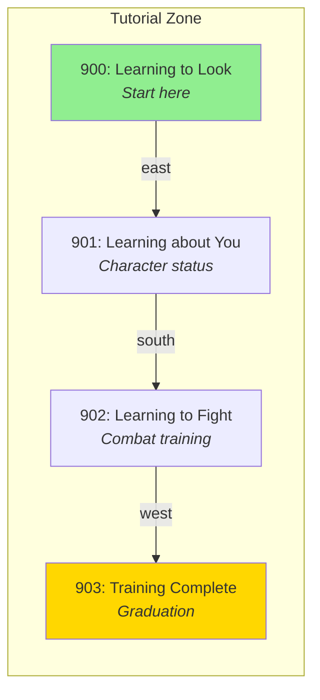

---

### Frostfang (City Hub - ~95 rooms)

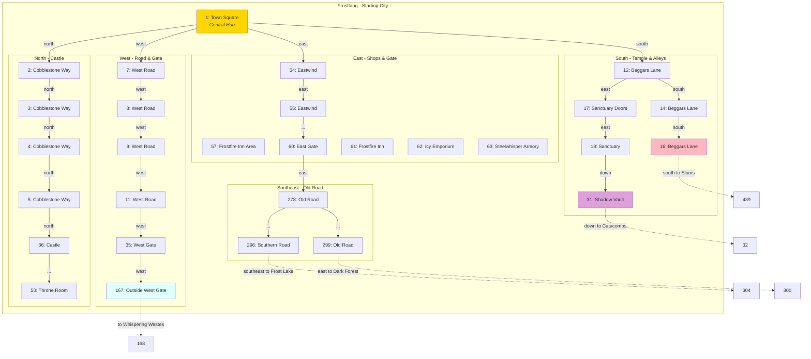

---

### Catacombs (Dungeon - ~70 rooms)

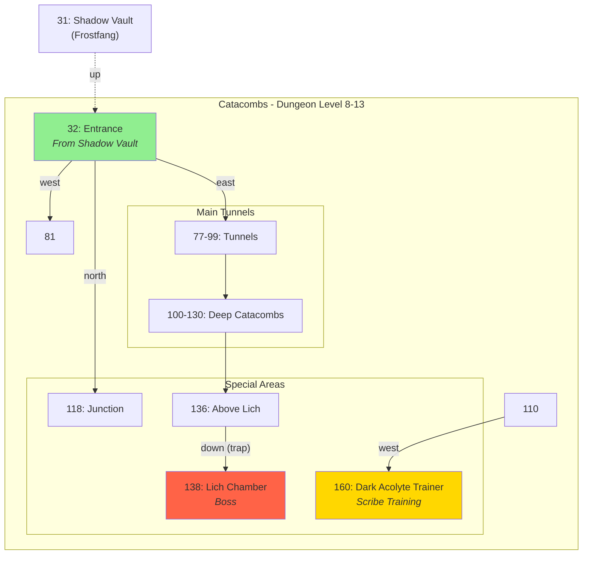

---

### Frostfang Slums (Lvl 5-10 - ~58 rooms)

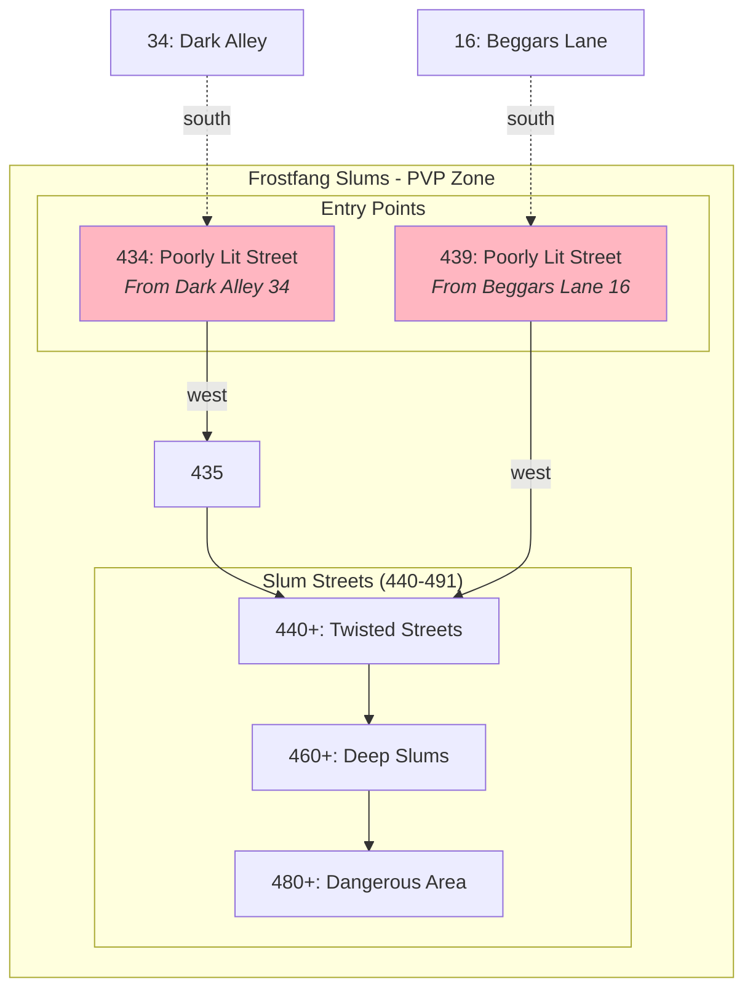

---

### Whispering Wastes (Lvl 5-25 - ~51 rooms)

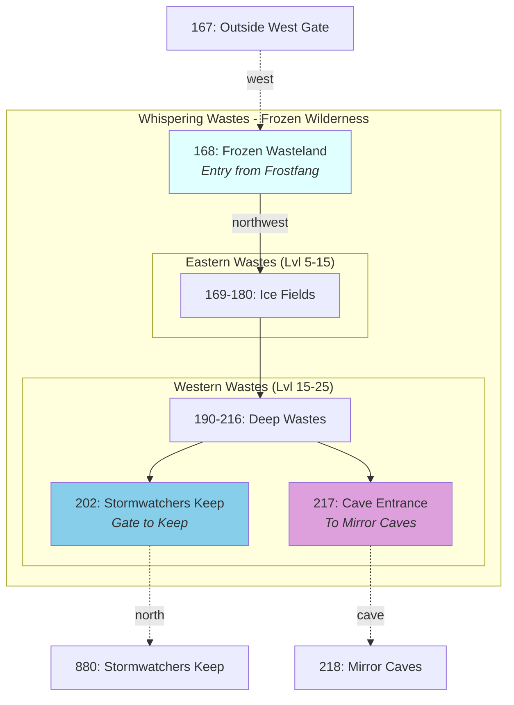

---

### Frost Lake (Lvl 10-20 - ~125 rooms)

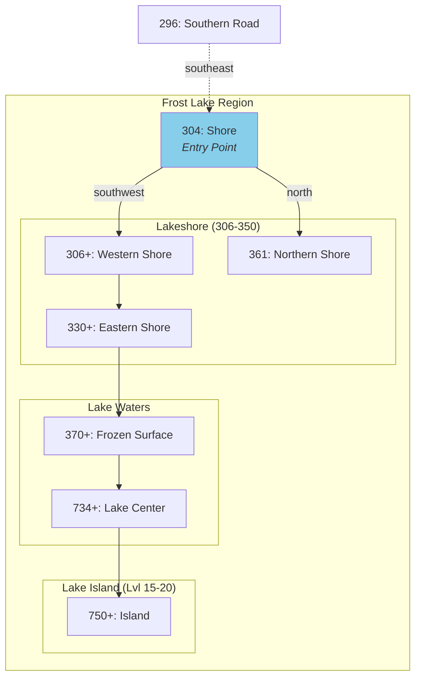

---

### Dark Forest (Lvl 10-30 - ~165 rooms)

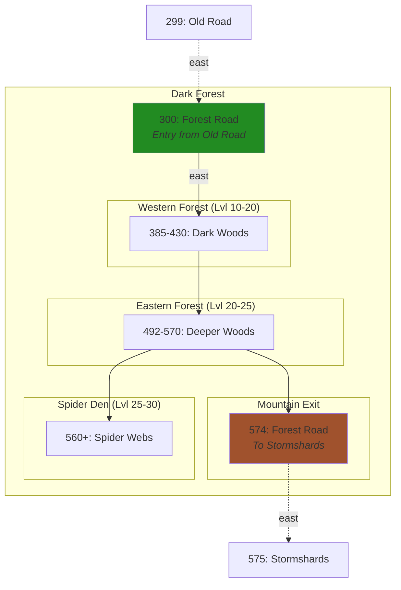

---

### Stormshards (Lvl 30-40 - ~40 rooms)

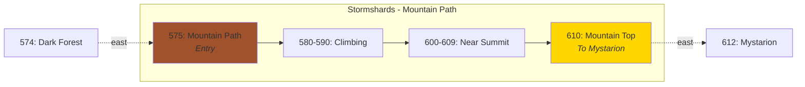

---

### Mystarion (Lvl 40-50 - ~130 rooms)

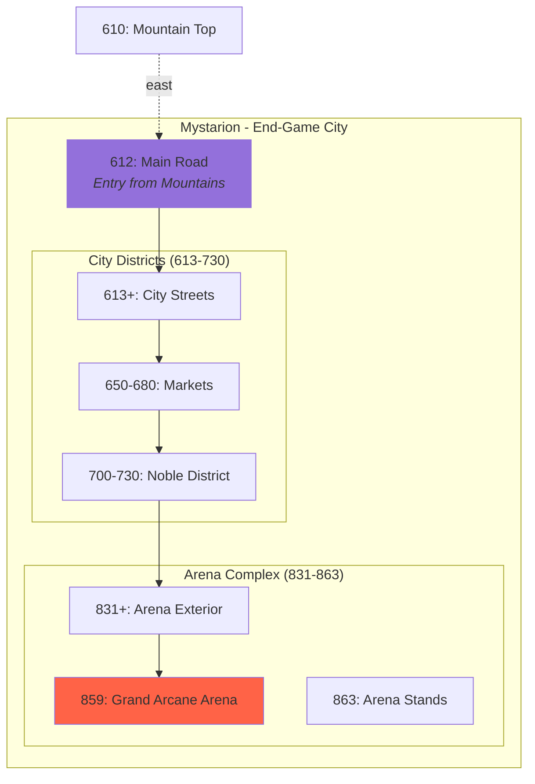

---

### Special Zones

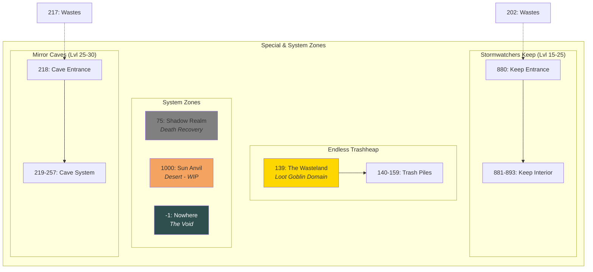

---

## Level Progression Path

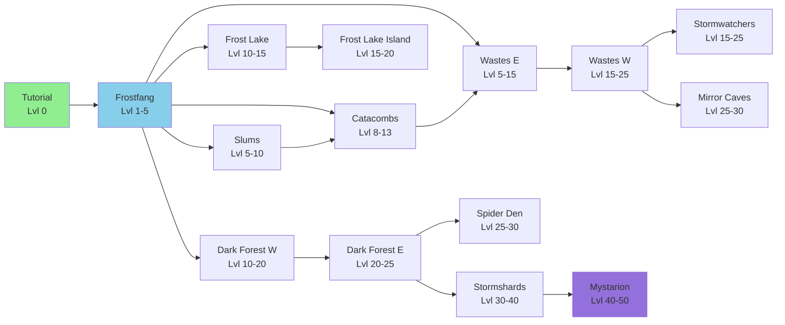

---

## Core vs Optional Content

### CORE (Keep for Minimal Viable World)
- **Tutorial** (4 rooms): Essential onboarding
- **Frostfang** (~95 rooms): Central hub, shops, services
- **Frostfang Slums** (~58 rooms): Early progression, PVP area
- **Catacombs** (~70 rooms): First dungeon, undead theme
- **Whispering Wastes** (~51 rooms): Gateway to outer zones

### OPTIONAL (Can be replaced/removed)
- **Frost Lake** (~125 rooms): Side content, lake exploration
- **Dark Forest** (~165 rooms): Mid-game content, spider theme
- **Mirror Caves** (~40 rooms): Late mid-game dungeon
- **Stormshards** (~40 rooms): Transition zone to end-game
- **Stormwatchers Keep** (~14 rooms): Small dungeon in wastes
- **Mystarion** (~130 rooms): End-game city

### SPECIAL/SYSTEM
- **Endless Trashheap** (~21 rooms): Self-contained special zone
- **Shadow Realm** (1 room): Death mechanic
- **Nowhere** (1 room): System void
- **Sun Anvil** (1 room): Work in progress

---

## Notes

1. **Cross-area connections** are primarily one-way conceptually (you progress outward from Frostfang) but rooms have bidirectional exits
2. **Room IDs are not sequential within zones** - some zones have gaps or outliers
3. **Endless Trashheap has no external connections** - likely teleport/quest access only
4. **Sun Anvil is WIP** - has no exits defined yet
5. **Shadow Realm and Nowhere** are system zones for death/error states
